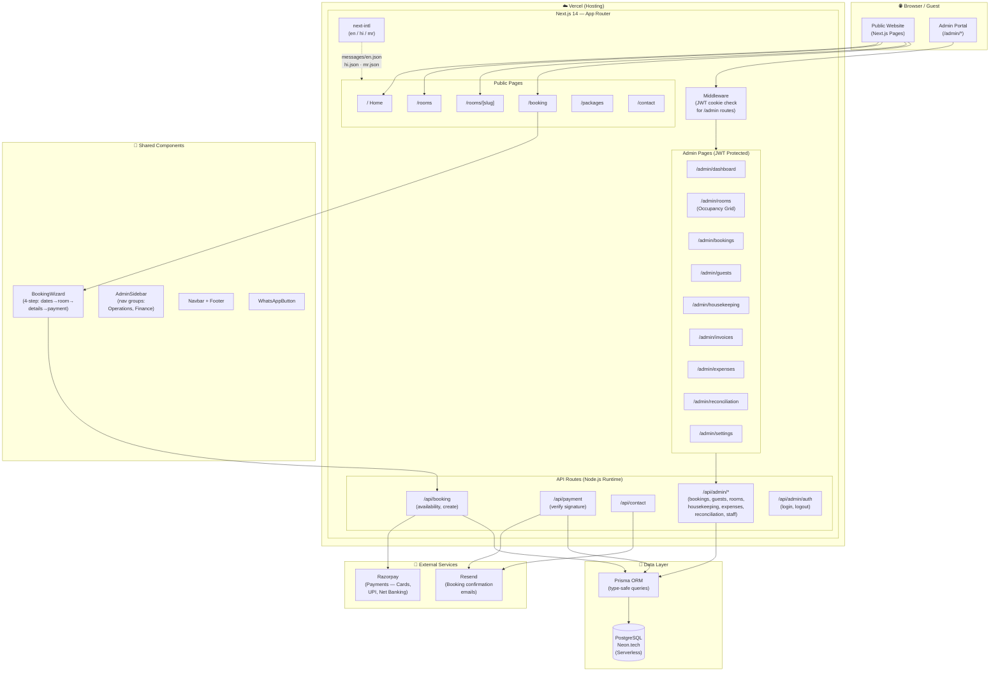
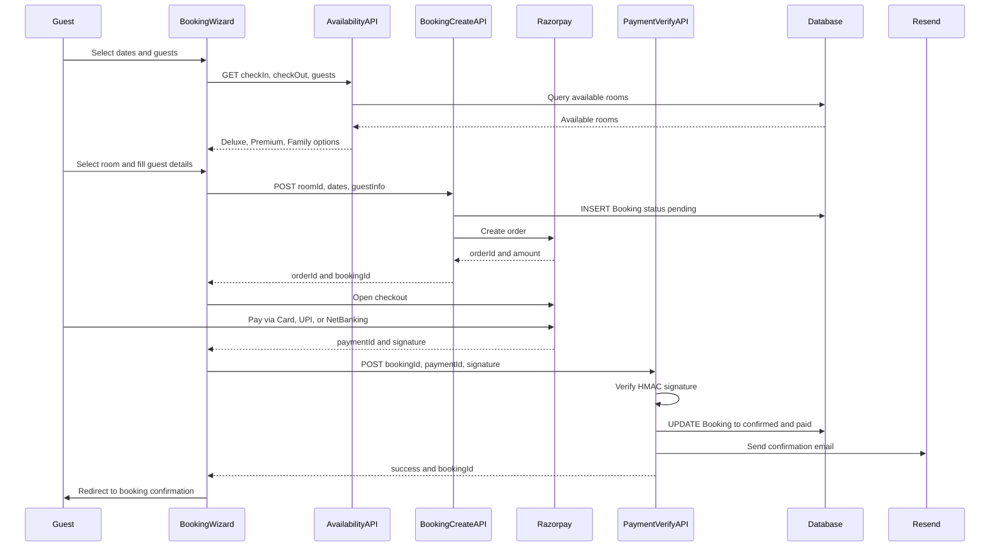
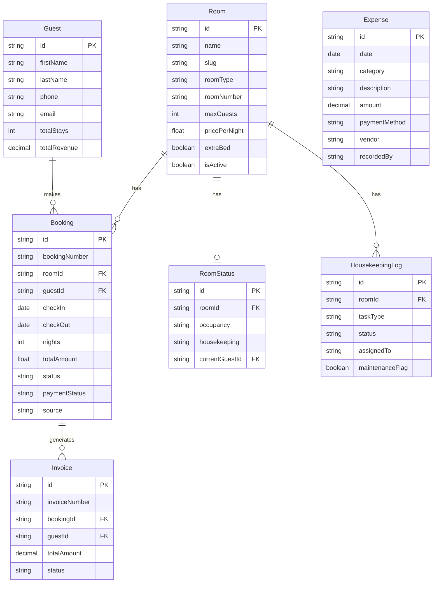
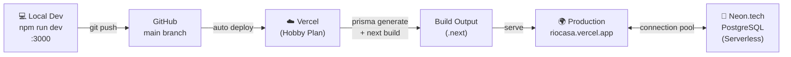

# Rio Casa — Architecture Diagram

## System Architecture

```mermaid
graph TB
    subgraph Client["🌐 Browser / Guest"]
        GuestUI["Public Website\n(Next.js Pages)"]
        AdminUI["Admin Portal\n(/admin/*)"]
    end

    subgraph Vercel["☁️ Vercel (Hosting)"]
        subgraph NextJS["Next.js 14 — App Router"]
            subgraph PublicPages["Public Pages"]
                Home["/ Home"]
                Rooms["/rooms"]
                RoomDetail["/rooms/[slug]"]
                Booking["/booking"]
                Packages["/packages"]
                Contact["/contact"]
            end

            subgraph AdminPages["Admin Pages (JWT Protected)"]
                Dashboard["/admin/dashboard"]
                FrontDesk["/admin/rooms\n(Occupancy Grid)"]
                Bookings["/admin/bookings"]
                Guests["/admin/guests"]
                HK["/admin/housekeeping"]
                Invoices["/admin/invoices"]
                Expenses["/admin/expenses"]
                Reconcile["/admin/reconciliation"]
                Settings["/admin/settings"]
            end

            subgraph API["API Routes (Node.js Runtime)"]
                BookingAPI["/api/booking\n(availability, create)"]
                PaymentAPI["/api/payment\n(verify signature)"]
                ContactAPI["/api/contact"]
                AdminAPI["/api/admin/*\n(bookings, guests, rooms,\nhousekeeping, expenses,\nreconciliation, staff)"]
                AuthAPI["/api/admin/auth\n(login, logout)"]
            end

            Middleware["Middleware\n(JWT cookie check\nfor /admin routes)"]
            I18n["next-intl\n(en / hi / mr)"]
        end
    end

    subgraph Data["💾 Data Layer"]
        Prisma["Prisma ORM\n(type-safe queries)"]
        NeonDB[("PostgreSQL\nNeon.tech\n(Serverless)")]
    end

    subgraph External["🔌 External Services"]
        Razorpay["Razorpay\n(Payments — Cards,\nUPI, Net Banking)"]
        Resend["Resend\n(Booking confirmation\nemails)"]
    end

    subgraph Components["🧩 Shared Components"]
        BookingWizard["BookingWizard\n(4-step: dates→room→\ndetails→payment)"]
        AdminSidebar["AdminSidebar\n(nav groups:\nOperations, Finance)"]
        Navbar["Navbar + Footer"]
        WhatsApp["WhatsAppButton"]
    end

    %% Guest flow
    GuestUI --> Home & Rooms & RoomDetail & Booking
    Booking --> BookingWizard
    BookingWizard --> BookingAPI
    BookingAPI --> Razorpay
    PaymentAPI --> Resend

    %% Admin flow
    AdminUI --> Middleware
    Middleware --> AdminPages
    AdminPages --> AdminAPI
    AdminAPI --> Prisma
    Prisma --> NeonDB

    %% API → DB
    BookingAPI --> Prisma
    PaymentAPI --> Prisma
    ContactAPI --> Resend

    %% i18n
    I18n -.->|"messages/en.json\nhi.json · mr.json"| PublicPages
```

---

## Data Flow — Guest Booking

```mermaid
sequenceDiagram
    participant Guest
    participant BookingWizard
    participant AvailabilityAPI
    participant BookingCreateAPI
    participant Razorpay
    participant PaymentVerifyAPI
    participant Database
    participant Resend

    Guest->>BookingWizard: Select dates and guests
    BookingWizard->>AvailabilityAPI: GET checkIn, checkOut, guests
    AvailabilityAPI->>Database: Query available rooms
    Database-->>AvailabilityAPI: Available rooms
    AvailabilityAPI-->>BookingWizard: Deluxe, Premium, Family options

    Guest->>BookingWizard: Select room and fill guest details
    BookingWizard->>BookingCreateAPI: POST roomId, dates, guestInfo
    BookingCreateAPI->>Database: INSERT Booking status pending
    BookingCreateAPI->>Razorpay: Create order
    Razorpay-->>BookingCreateAPI: orderId and amount
    BookingCreateAPI-->>BookingWizard: orderId and bookingId

    BookingWizard->>Razorpay: Open checkout
    Guest->>Razorpay: Pay via Card, UPI, or NetBanking
    Razorpay-->>BookingWizard: paymentId and signature

    BookingWizard->>PaymentVerifyAPI: POST bookingId, paymentId, signature
    PaymentVerifyAPI->>PaymentVerifyAPI: Verify HMAC signature
    PaymentVerifyAPI->>Database: UPDATE Booking to confirmed and paid
    PaymentVerifyAPI->>Resend: Send confirmation email
    PaymentVerifyAPI-->>BookingWizard: success and bookingId
    BookingWizard->>Guest: Redirect to booking confirmation
```

---

## Database Schema (Key Models)

```mermaid
erDiagram
    Room {
        string id PK
        string name
        string slug
        string roomType
        string roomNumber
        int maxGuests
        float pricePerNight
        boolean extraBed
        boolean isActive
    }

    Guest {
        string id PK
        string firstName
        string lastName
        string phone
        string email
        int totalStays
        decimal totalRevenue
    }

    Booking {
        string id PK
        string bookingNumber
        string roomId FK
        string guestId FK
        date checkIn
        date checkOut
        int nights
        float totalAmount
        string status
        string paymentStatus
        string source
    }

    Expense {
        string id PK
        date date
        string category
        string description
        decimal amount
        string paymentMethod
        string vendor
        string recordedBy
    }

    HousekeepingLog {
        string id PK
        string roomId FK
        string taskType
        string status
        string assignedTo
        boolean maintenanceFlag
    }

    Invoice {
        string id PK
        string invoiceNumber
        string bookingId FK
        string guestId FK
        decimal totalAmount
        string status
    }

    RoomStatus {
        string id PK
        string roomId FK
        string occupancy
        string housekeeping
        string currentGuestId FK
    }

    Room ||--o{ Booking : "has"
    Room ||--o| RoomStatus : "has"
    Room ||--o{ HousekeepingLog : "has"
    Guest ||--o{ Booking : "makes"
    Booking ||--o{ Invoice : "generates"
```

---

## Deployment Pipeline

```mermaid
flowchart LR
    Dev["💻 Local Dev\nnpm run dev\n:3000"] -->|git push| GitHub["GitHub\nmain branch"]
    GitHub -->|auto deploy| Vercel["☁️ Vercel\n(Hobby Plan)"]
    Vercel -->|prisma generate\n+ next build| Build["Build Output\n(.next)"]
    Build -->|serve| Prod["🌍 Production\nriocasa.vercel.app"]
    Prod <-->|connection pool| Neon["🐘 Neon.tech\nPostgreSQL\n(Serverless)"]
```
